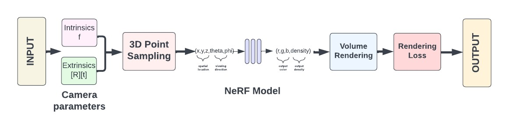

# Video Enhancement and Restoration Using Neural Radiance Fields (NeRF)

This project, titled "Video Enhancement and Restoration Using Neural Radiance Fields (NeRF)," is part of a Samsung PRISM internship and focuses on enhancing video quality by leveraging NeRF to generate high-quality novel views from sparse and noisy input images. The project addresses challenges such as noisy and blurry views produced by NeRF by employing a method that utilizes more samples per ray to generate better-quality novel views. The approach involves several key steps:

## Approach

1. **Input Image**: Each frame in the video sequence is treated as an individual input image.
2. **Estimating Camera Parameters**: Neural networks estimate intrinsic parameters like focal length and extrinsic parameters such as pose (position and orientation).
3. **3D Point Sampling**: Samples 3D points in the scene based on the estimated camera parameters, representing locations in the 3D space corresponding to the input images.
4. **NeRF Model**: Utilizes the NeRF architecture to predict volumetric density and color values for any given 3D point in the scene.
5. **Volume Rendering**: Generates 2D images from the 3D scene representation, integrating predicted volumetric density and color values along rays corresponding to input image pixels.
6. **Rendering Loss**: Defines a loss function comparing rendered images with ground truth input images, guiding the optimization process to improve the NeRF model's accuracy.
7. **Output Image**: Produces the final enhanced video frames with improved visual quality, reduced noise, and enhanced details.

The dataset comprises custom datasets along with standard datasets such as NeRF-Synthetic, Blender Scenes, and LLFF. The custom datasets include frames extracted from static videos with varying complexities, covering a broad spectrum of real-world conditions. These datasets were preprocessed and used as input for the NeRF model. Experimental results demonstrate significant improvements in visual quality, noise reduction, and scene dynamics learning. Comparative analysis of PSNR values shows the model's effectiveness over existing NeRF-based models like NeRF, NeRF-Bi, NeRF-Liif, and NeRF-Swin. The project's success highlights the broad applicability of NeRF in various fields, including entertainment, surveillance, and augmented reality, emphasizing its potential impact on video processing.
